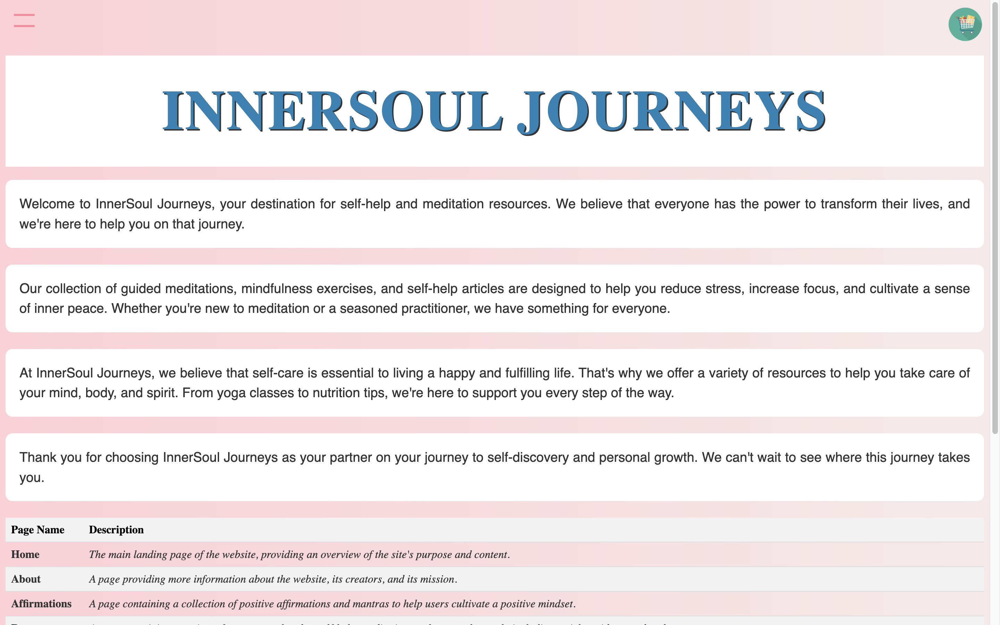
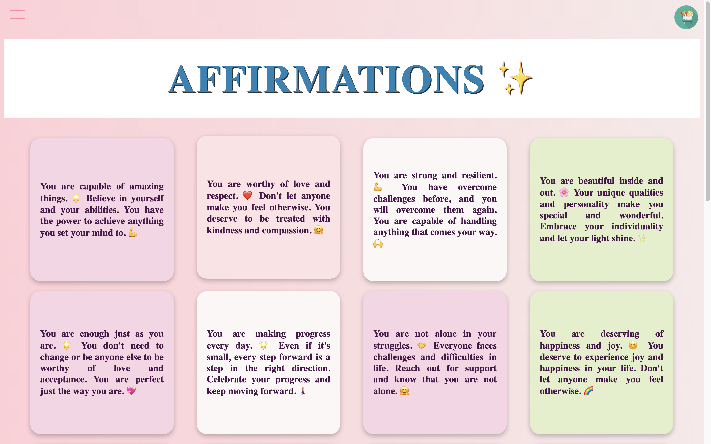
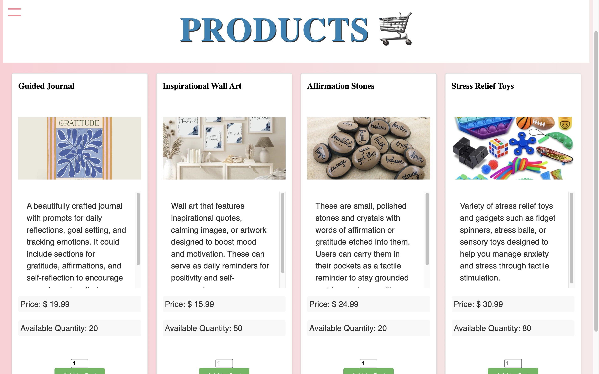

# ✨🧘‍♀️ | InnerSoul Journeys

InnerSoul Journeys was crafted to cater to your meditation and self-care needs in a convenient, all-inclusive platform! Initially developed as a project 
for an advanced university course (CS315 - Internet Programming), we ensured its design was both engaging and compliant with the course guidelines.

Designed and implemented by: 
>- Cüneyt Aksoy
>- Paul Keiser

Technologies used: PHP, HTML, CSS, MySQL, JavaScript, Apache WebServer 

